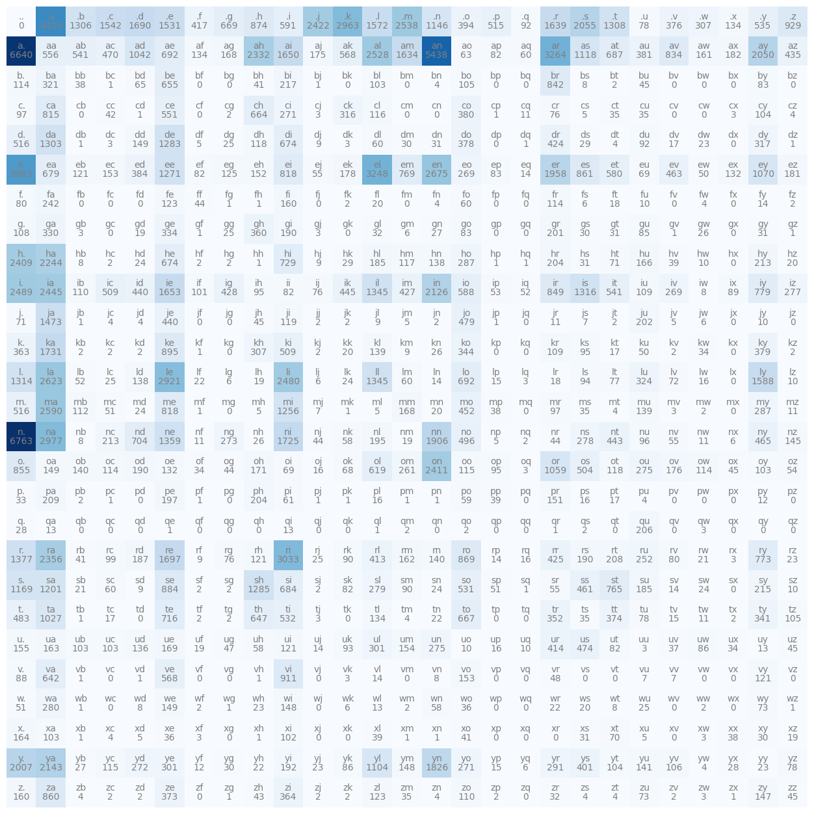
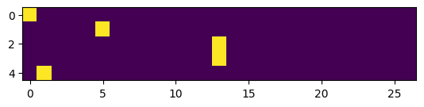
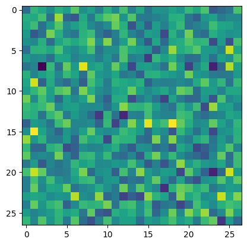
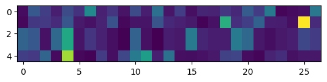

```python
import numpy as np
import matplotlib.pyplot as plt
import pandas as pd
%matplotlib inline
```


```python
words = open('names.txt', 'r').read().splitlines()
words[:10]
```


    ['emma',
     'olivia',
     'ava',
     'isabella',
     'sophia',
     'charlotte',
     'mia',
     'amelia',
     'harper',
     'evelyn']


```python
len(words)
```


    32033


```python
min(len(w) for w in words), max(len(w) for w in words)
```


    (2, 15)


```python
b = {}
for w in words:
    chs = ['<S>'] + list(w) + ['<E>']
    for ch1,ch2 in zip(chs, chs[1:]):
        bigram = (ch1, ch2)
        b[bigram] = b.get(bigram, 0) + 1
        # print(ch1, ch2) # individual characters, and the next character
```


```python
sorted(b.items(), key=lambda kv: -kv[1])
```


    [(('n', '<E>'), 6763),
     (('a', '<E>'), 6640),
     (('a', 'n'), 5438),
     (('<S>', 'a'), 4410),
     (('e', '<E>'), 3983),
     (('a', 'r'), 3264),
     (('e', 'l'), 3248),
     (('r', 'i'), 3033),
     (('n', 'a'), 2977),
     (('<S>', 'k'), 2963),
     (('l', 'e'), 2921),
     (('e', 'n'), 2675),
     (('l', 'a'), 2623),
     (('m', 'a'), 2590),
     (('<S>', 'm'), 2538),
     (('a', 'l'), 2528),
     (('i', '<E>'), 2489),
     (('l', 'i'), 2480),
     (('i', 'a'), 2445),
     (('<S>', 'j'), 2422),
     (('o', 'n'), 2411),
     (('h', '<E>'), 2409),
     (('r', 'a'), 2356),
     (('a', 'h'), 2332),
     (('h', 'a'), 2244),
     (('y', 'a'), 2143),
     (('i', 'n'), 2126),
     (('<S>', 's'), 2055),
     (('a', 'y'), 2050),
     (('y', '<E>'), 2007),
     (('e', 'r'), 1958),
     (('n', 'n'), 1906),
     (('y', 'n'), 1826),
     (('k', 'a'), 1731),
     (('n', 'i'), 1725),
     (('r', 'e'), 1697),
     (('<S>', 'd'), 1690),
     (('i', 'e'), 1653),
     (('a', 'i'), 1650),
     (('<S>', 'r'), 1639),
     (('a', 'm'), 1634),
     (('l', 'y'), 1588),
     (('<S>', 'l'), 1572),
     (('<S>', 'c'), 1542),
     (('<S>', 'e'), 1531),
     (('j', 'a'), 1473),
     (('r', '<E>'), 1377),
     (('n', 'e'), 1359),
     (('l', 'l'), 1345),
     (('i', 'l'), 1345),
     (('i', 's'), 1316),
     (('l', '<E>'), 1314),
     (('<S>', 't'), 1308),
     (('<S>', 'b'), 1306),
     (('d', 'a'), 1303),
     (('s', 'h'), 1285),
     (('d', 'e'), 1283),
     (('e', 'e'), 1271),
     (('m', 'i'), 1256),
     (('s', 'a'), 1201),
     (('s', '<E>'), 1169),
     (('<S>', 'n'), 1146),
     (('a', 's'), 1118),
     (('y', 'l'), 1104),
     (('e', 'y'), 1070),
     (('o', 'r'), 1059),
     (('a', 'd'), 1042),
     (('t', 'a'), 1027),
     (('<S>', 'z'), 929),
     (('v', 'i'), 911),
     (('k', 'e'), 895),
     (('s', 'e'), 884),
     (('<S>', 'h'), 874),
     (('r', 'o'), 869),
     (('e', 's'), 861),
     (('z', 'a'), 860),
     (('o', '<E>'), 855),
     (('i', 'r'), 849),
     (('b', 'r'), 842),
     (('a', 'v'), 834),
     (('m', 'e'), 818),
     (('e', 'i'), 818),
     (('c', 'a'), 815),
     (('i', 'y'), 779),
     (('r', 'y'), 773),
     (('e', 'm'), 769),
     (('s', 't'), 765),
     (('h', 'i'), 729),
     (('t', 'e'), 716),
     (('n', 'd'), 704),
     (('l', 'o'), 692),
     (('a', 'e'), 692),
     (('a', 't'), 687),
     (('s', 'i'), 684),
     (('e', 'a'), 679),
     (('d', 'i'), 674),
     (('h', 'e'), 674),
     (('<S>', 'g'), 669),
     (('t', 'o'), 667),
     (('c', 'h'), 664),
     (('b', 'e'), 655),
     (('t', 'h'), 647),
     (('v', 'a'), 642),
     (('o', 'l'), 619),
     (('<S>', 'i'), 591),
     (('i', 'o'), 588),
     (('e', 't'), 580),
     (('v', 'e'), 568),
     (('a', 'k'), 568),
     (('a', 'a'), 556),
     (('c', 'e'), 551),
     (('a', 'b'), 541),
     (('i', 't'), 541),
     (('<S>', 'y'), 535),
     (('t', 'i'), 532),
     (('s', 'o'), 531),
     (('m', '<E>'), 516),
     (('d', '<E>'), 516),
     (('<S>', 'p'), 515),
     (('i', 'c'), 509),
     (('k', 'i'), 509),
     (('o', 's'), 504),
     (('n', 'o'), 496),
     (('t', '<E>'), 483),
     (('j', 'o'), 479),
     (('u', 's'), 474),
     (('a', 'c'), 470),
     (('n', 'y'), 465),
     (('e', 'v'), 463),
     (('s', 's'), 461),
     (('m', 'o'), 452),
     (('i', 'k'), 445),
     (('n', 't'), 443),
     (('i', 'd'), 440),
     (('j', 'e'), 440),
     (('a', 'z'), 435),
     (('i', 'g'), 428),
     (('i', 'm'), 427),
     (('r', 'r'), 425),
     (('d', 'r'), 424),
     (('<S>', 'f'), 417),
     (('u', 'r'), 414),
     (('r', 'l'), 413),
     (('y', 's'), 401),
     (('<S>', 'o'), 394),
     (('e', 'd'), 384),
     (('a', 'u'), 381),
     (('c', 'o'), 380),
     (('k', 'y'), 379),
     (('d', 'o'), 378),
     (('<S>', 'v'), 376),
     (('t', 't'), 374),
     (('z', 'e'), 373),
     (('z', 'i'), 364),
     (('k', '<E>'), 363),
     (('g', 'h'), 360),
     (('t', 'r'), 352),
     (('k', 'o'), 344),
     (('t', 'y'), 341),
     (('g', 'e'), 334),
     (('g', 'a'), 330),
     (('l', 'u'), 324),
     (('b', 'a'), 321),
     (('d', 'y'), 317),
     (('c', 'k'), 316),
     (('<S>', 'w'), 307),
     (('k', 'h'), 307),
     (('u', 'l'), 301),
     (('y', 'e'), 301),
     (('y', 'r'), 291),
     (('m', 'y'), 287),
     (('h', 'o'), 287),
     (('w', 'a'), 280),
     (('s', 'l'), 279),
     (('n', 's'), 278),
     (('i', 'z'), 277),
     (('u', 'n'), 275),
     (('o', 'u'), 275),
     (('n', 'g'), 273),
     (('y', 'd'), 272),
     (('c', 'i'), 271),
     (('y', 'o'), 271),
     (('i', 'v'), 269),
     (('e', 'o'), 269),
     (('o', 'm'), 261),
     (('r', 'u'), 252),
     (('f', 'a'), 242),
     (('b', 'i'), 217),
     (('s', 'y'), 215),
     (('n', 'c'), 213),
     (('h', 'y'), 213),
     (('p', 'a'), 209),
     (('r', 't'), 208),
     (('q', 'u'), 206),
     (('p', 'h'), 204),
     (('h', 'r'), 204),
     (('j', 'u'), 202),
     (('g', 'r'), 201),
     (('p', 'e'), 197),
     (('n', 'l'), 195),
     (('y', 'i'), 192),
     (('g', 'i'), 190),
     (('o', 'd'), 190),
     (('r', 's'), 190),
     (('r', 'd'), 187),
     (('h', 'l'), 185),
     (('s', 'u'), 185),
     (('a', 'x'), 182),
     (('e', 'z'), 181),
     (('e', 'k'), 178),
     (('o', 'v'), 176),
     (('a', 'j'), 175),
     (('o', 'h'), 171),
     (('u', 'e'), 169),
     (('m', 'm'), 168),
     (('a', 'g'), 168),
     (('h', 'u'), 166),
     (('x', '<E>'), 164),
     (('u', 'a'), 163),
     (('r', 'm'), 162),
     (('a', 'w'), 161),
     (('f', 'i'), 160),
     (('z', '<E>'), 160),
     (('u', '<E>'), 155),
     (('u', 'm'), 154),
     (('e', 'c'), 153),
     (('v', 'o'), 153),
     (('e', 'h'), 152),
     (('p', 'r'), 151),
     (('d', 'd'), 149),
     (('o', 'a'), 149),
     (('w', 'e'), 149),
     (('w', 'i'), 148),
     (('y', 'm'), 148),
     (('z', 'y'), 147),
     (('n', 'z'), 145),
     (('y', 'u'), 141),
     (('r', 'n'), 140),
     (('o', 'b'), 140),
     (('k', 'l'), 139),
     (('m', 'u'), 139),
     (('l', 'd'), 138),
     (('h', 'n'), 138),
     (('u', 'd'), 136),
     (('<S>', 'x'), 134),
     (('t', 'l'), 134),
     (('a', 'f'), 134),
     (('o', 'e'), 132),
     (('e', 'x'), 132),
     (('e', 'g'), 125),
     (('f', 'e'), 123),
     (('z', 'l'), 123),
     (('u', 'i'), 121),
     (('v', 'y'), 121),
     (('e', 'b'), 121),
     (('r', 'h'), 121),
     (('j', 'i'), 119),
     (('o', 't'), 118),
     (('d', 'h'), 118),
     (('h', 'm'), 117),
     (('c', 'l'), 116),
     (('o', 'o'), 115),
     (('y', 'c'), 115),
     (('o', 'w'), 114),
     (('o', 'c'), 114),
     (('f', 'r'), 114),
     (('b', '<E>'), 114),
     (('m', 'b'), 112),
     (('z', 'o'), 110),
     (('i', 'b'), 110),
     (('i', 'u'), 109),
     (('k', 'r'), 109),
     (('g', '<E>'), 108),
     (('y', 'v'), 106),
     (('t', 'z'), 105),
     (('b', 'o'), 105),
     (('c', 'y'), 104),
     (('y', 't'), 104),
     (('u', 'b'), 103),
     (('u', 'c'), 103),
     (('x', 'a'), 103),
     (('b', 'l'), 103),
     (('o', 'y'), 103),
     (('x', 'i'), 102),
     (('i', 'f'), 101),
     (('r', 'c'), 99),
     (('c', '<E>'), 97),
     (('m', 'r'), 97),
     (('n', 'u'), 96),
     (('o', 'p'), 95),
     (('i', 'h'), 95),
     (('k', 's'), 95),
     (('l', 's'), 94),
     (('u', 'k'), 93),
     (('<S>', 'q'), 92),
     (('d', 'u'), 92),
     (('s', 'm'), 90),
     (('r', 'k'), 90),
     (('i', 'x'), 89),
     (('v', '<E>'), 88),
     (('y', 'k'), 86),
     (('u', 'w'), 86),
     (('g', 'u'), 85),
     (('b', 'y'), 83),
     (('e', 'p'), 83),
     (('g', 'o'), 83),
     (('s', 'k'), 82),
     (('u', 't'), 82),
     (('a', 'p'), 82),
     (('e', 'f'), 82),
     (('i', 'i'), 82),
     (('r', 'v'), 80),
     (('f', '<E>'), 80),
     (('t', 'u'), 78),
     (('y', 'z'), 78),
     (('<S>', 'u'), 78),
     (('l', 't'), 77),
     (('r', 'g'), 76),
     (('c', 'r'), 76),
     (('i', 'j'), 76),
     (('w', 'y'), 73),
     (('z', 'u'), 73),
     (('l', 'v'), 72),
     (('h', 't'), 71),
     (('j', '<E>'), 71),
     (('x', 't'), 70),
     (('o', 'i'), 69),
     (('e', 'u'), 69),
     (('o', 'k'), 68),
     (('b', 'd'), 65),
     (('a', 'o'), 63),
     (('p', 'i'), 61),
     (('s', 'c'), 60),
     (('d', 'l'), 60),
     (('l', 'm'), 60),
     (('a', 'q'), 60),
     (('f', 'o'), 60),
     (('p', 'o'), 59),
     (('n', 'k'), 58),
     (('w', 'n'), 58),
     (('u', 'h'), 58),
     (('e', 'j'), 55),
     (('n', 'v'), 55),
     (('s', 'r'), 55),
     (('o', 'z'), 54),
     (('i', 'p'), 53),
     (('l', 'b'), 52),
     (('i', 'q'), 52),
     (('w', '<E>'), 51),
     (('m', 'c'), 51),
     (('s', 'p'), 51),
     (('e', 'w'), 50),
     (('k', 'u'), 50),
     (('v', 'r'), 48),
     (('u', 'g'), 47),
     (('o', 'x'), 45),
     (('u', 'z'), 45),
     (('z', 'z'), 45),
     (('j', 'h'), 45),
     (('b', 'u'), 45),
     (('o', 'g'), 44),
     (('n', 'r'), 44),
     (('f', 'f'), 44),
     (('n', 'j'), 44),
     (('z', 'h'), 43),
     (('c', 'c'), 42),
     (('r', 'b'), 41),
     (('x', 'o'), 41),
     (('b', 'h'), 41),
     (('p', 'p'), 39),
     (('x', 'l'), 39),
     (('h', 'v'), 39),
     (('b', 'b'), 38),
     (('m', 'p'), 38),
     (('x', 'x'), 38),
     (('u', 'v'), 37),
     (('x', 'e'), 36),
     (('w', 'o'), 36),
     (('c', 't'), 35),
     (('z', 'm'), 35),
     (('t', 's'), 35),
     (('m', 's'), 35),
     (('c', 'u'), 35),
     (('o', 'f'), 34),
     (('u', 'x'), 34),
     (('k', 'w'), 34),
     (('p', '<E>'), 33),
     (('g', 'l'), 32),
     (('z', 'r'), 32),
     (('d', 'n'), 31),
     (('g', 't'), 31),
     (('g', 'y'), 31),
     (('h', 's'), 31),
     (('x', 's'), 31),
     (('g', 's'), 30),
     (('x', 'y'), 30),
     (('y', 'g'), 30),
     (('d', 'm'), 30),
     (('d', 's'), 29),
     (('h', 'k'), 29),
     (('y', 'x'), 28),
     (('q', '<E>'), 28),
     (('g', 'n'), 27),
     (('y', 'b'), 27),
     (('g', 'w'), 26),
     (('n', 'h'), 26),
     (('k', 'n'), 26),
     (('g', 'g'), 25),
     (('d', 'g'), 25),
     (('l', 'c'), 25),
     (('r', 'j'), 25),
     (('w', 'u'), 25),
     (('l', 'k'), 24),
     (('m', 'd'), 24),
     (('s', 'w'), 24),
     (('s', 'n'), 24),
     (('h', 'd'), 24),
     (('w', 'h'), 23),
     (('y', 'j'), 23),
     (('y', 'y'), 23),
     (('r', 'z'), 23),
     (('d', 'w'), 23),
     (('w', 'r'), 22),
     (('t', 'n'), 22),
     (('l', 'f'), 22),
     (('y', 'h'), 22),
     (('r', 'w'), 21),
     (('s', 'b'), 21),
     (('m', 'n'), 20),
     (('f', 'l'), 20),
     (('w', 's'), 20),
     (('k', 'k'), 20),
     (('h', 'z'), 20),
     (('g', 'd'), 19),
     (('l', 'h'), 19),
     (('n', 'm'), 19),
     (('x', 'z'), 19),
     (('u', 'f'), 19),
     (('f', 't'), 18),
     (('l', 'r'), 18),
     (('p', 't'), 17),
     (('t', 'c'), 17),
     (('k', 't'), 17),
     (('d', 'v'), 17),
     (('u', 'p'), 16),
     (('p', 'l'), 16),
     (('l', 'w'), 16),
     (('p', 's'), 16),
     (('o', 'j'), 16),
     (('r', 'q'), 16),
     (('y', 'p'), 15),
     (('l', 'p'), 15),
     (('t', 'v'), 15),
     (('r', 'p'), 14),
     (('l', 'n'), 14),
     (('e', 'q'), 14),
     (('f', 'y'), 14),
     (('s', 'v'), 14),
     (('u', 'j'), 14),
     (('v', 'l'), 14),
     (('q', 'a'), 13),
     (('u', 'y'), 13),
     (('q', 'i'), 13),
     (('w', 'l'), 13),
     (('p', 'y'), 12),
     (('y', 'f'), 12),
     (('c', 'q'), 11),
     (('j', 'r'), 11),
     (('n', 'w'), 11),
     (('n', 'f'), 11),
     (('t', 'w'), 11),
     (('m', 'z'), 11),
     (('u', 'o'), 10),
     (('f', 'u'), 10),
     (('l', 'z'), 10),
     (('h', 'w'), 10),
     (('u', 'q'), 10),
     (('j', 'y'), 10),
     (('s', 'z'), 10),
     (('s', 'd'), 9),
     (('j', 'l'), 9),
     (('d', 'j'), 9),
     (('k', 'm'), 9),
     (('r', 'f'), 9),
     (('h', 'j'), 9),
     (('v', 'n'), 8),
     (('n', 'b'), 8),
     (('i', 'w'), 8),
     (('h', 'b'), 8),
     (('b', 's'), 8),
     (('w', 't'), 8),
     (('w', 'd'), 8),
     (('v', 'v'), 7),
     (('v', 'u'), 7),
     (('j', 's'), 7),
     (('m', 'j'), 7),
     (('f', 's'), 6),
     (('l', 'g'), 6),
     (('l', 'j'), 6),
     (('j', 'w'), 6),
     (('n', 'x'), 6),
     (('y', 'q'), 6),
     (('w', 'k'), 6),
     (('g', 'm'), 6),
     (('x', 'u'), 5),
     (('m', 'h'), 5),
     (('m', 'l'), 5),
     (('j', 'm'), 5),
     (('c', 's'), 5),
     (('j', 'v'), 5),
     (('n', 'p'), 5),
     (('d', 'f'), 5),
     (('x', 'd'), 5),
     (('z', 'b'), 4),
     (('f', 'n'), 4),
     (('x', 'c'), 4),
     (('m', 't'), 4),
     (('t', 'm'), 4),
     (('z', 'n'), 4),
     (('z', 't'), 4),
     (('p', 'u'), 4),
     (('c', 'z'), 4),
     (('b', 'n'), 4),
     (('z', 's'), 4),
     (('f', 'w'), 4),
     (('d', 't'), 4),
     (('j', 'd'), 4),
     (('j', 'c'), 4),
     (('y', 'w'), 4),
     (('v', 'k'), 3),
     (('x', 'w'), 3),
     (('t', 'j'), 3),
     (('c', 'j'), 3),
     (('q', 'w'), 3),
     (('g', 'b'), 3),
     (('o', 'q'), 3),
     (('r', 'x'), 3),
     (('d', 'c'), 3),
     (('g', 'j'), 3),
     (('x', 'f'), 3),
     (('z', 'w'), 3),
     (('d', 'k'), 3),
     (('u', 'u'), 3),
     (('m', 'v'), 3),
     (('c', 'x'), 3),
     (('l', 'q'), 3),
     (('p', 'b'), 2),
     (('t', 'g'), 2),
     (('q', 's'), 2),
     (('t', 'x'), 2),
     (('f', 'k'), 2),
     (('b', 't'), 2),
     (('j', 'n'), 2),
     (('k', 'c'), 2),
     (('z', 'k'), 2),
     (('s', 'j'), 2),
     (('s', 'f'), 2),
     (('z', 'j'), 2),
     (('n', 'q'), 2),
     (('f', 'z'), 2),
     (('h', 'g'), 2),
     (('w', 'w'), 2),
     (('k', 'j'), 2),
     (('j', 'k'), 2),
     (('w', 'm'), 2),
     (('z', 'c'), 2),
     (('z', 'v'), 2),
     (('w', 'f'), 2),
     (('q', 'm'), 2),
     (('k', 'z'), 2),
     (('j', 'j'), 2),
     (('z', 'p'), 2),
     (('j', 't'), 2),
     (('k', 'b'), 2),
     (('m', 'w'), 2),
     (('h', 'f'), 2),
     (('c', 'g'), 2),
     (('t', 'f'), 2),
     (('h', 'c'), 2),
     (('q', 'o'), 2),
     (('k', 'd'), 2),
     (('k', 'v'), 2),
     (('s', 'g'), 2),
     (('z', 'd'), 2),
     (('q', 'r'), 1),
     (('d', 'z'), 1),
     (('p', 'j'), 1),
     (('q', 'l'), 1),
     (('p', 'f'), 1),
     (('q', 'e'), 1),
     (('b', 'c'), 1),
     (('c', 'd'), 1),
     (('m', 'f'), 1),
     (('p', 'n'), 1),
     (('w', 'b'), 1),
     (('p', 'c'), 1),
     (('h', 'p'), 1),
     (('f', 'h'), 1),
     (('b', 'j'), 1),
     (('f', 'g'), 1),
     (('z', 'g'), 1),
     (('c', 'p'), 1),
     (('p', 'k'), 1),
     (('p', 'm'), 1),
     (('x', 'n'), 1),
     (('s', 'q'), 1),
     (('k', 'f'), 1),
     (('m', 'k'), 1),
     (('x', 'h'), 1),
     (('g', 'f'), 1),
     (('v', 'b'), 1),
     (('j', 'p'), 1),
     (('g', 'z'), 1),
     (('v', 'd'), 1),
     (('d', 'b'), 1),
     (('v', 'h'), 1),
     (('h', 'h'), 1),
     (('g', 'v'), 1),
     (('d', 'q'), 1),
     (('x', 'b'), 1),
     (('w', 'z'), 1),
     (('h', 'q'), 1),
     (('j', 'b'), 1),
     (('x', 'm'), 1),
     (('w', 'g'), 1),
     (('t', 'b'), 1),
     (('z', 'x'), 1)]


```python
import torch
```


```python
chars = sorted(list(set(''.join(words))))
stoi = {s:i+1 for i,s in enumerate(chars)}
stoi['.'] = 0
itos = {i:s for s,i in stoi.items()}
N = torch.zeros((len(stoi), len(stoi)), dtype=torch.int32)

```


```python

for w in words:
    chs = ['.'] + list(w) + ['.']
    for ch1,ch2 in zip(chs, chs[1:]):
        ix1 = stoi[ch1]
        ix2 = stoi[ch2]
        N[ix1, ix2] += 1
        

```


```python
import matplotlib.pyplot as plt
%matplotlib inline

plt.figure(figsize=(16,16))
plt.imshow(N, cmap='Blues')
for i in range(27):
    for j in range(27):
        chstr = itos[i] + itos[j]
        plt.text(j, i, chstr, ha='center', va='bottom', color='gray')
        plt.text(j, i, N[i,j].item(), ha='center', va='top', color='gray')
plt.axis('off');
```


    

    


```python
N[0,:]
```


    tensor([   0, 4410, 1306, 1542, 1690, 1531,  417,  669,  874,  591, 2422, 2963,
            1572, 2538, 1146,  394,  515,   92, 1639, 2055, 1308,   78,  376,  307,
             134,  535,  929], dtype=torch.int32)


```python
p = N[0,:].float()
p = p / p.sum()

```


```python
g = torch.Generator().manual_seed(2147483647)

ix = torch.multinomial(p, num_samples=1, replacement=True, generator=g).item()
itos[ix]  
```


    'c'


```python
# generator
g = torch.Generator().manual_seed(2147483647)
p = torch.rand(3, generator=g)
p = p / p.sum()
p
```


    tensor([0.6064, 0.3033, 0.0903])


```python
torch.multinomial(p, num_samples=20, replacement=True, generator=g)
```


    tensor([1, 1, 2, 0, 0, 2, 1, 1, 0, 0, 0, 1, 1, 0, 0, 1, 1, 0, 0, 1])


```python
P = (N+1).float()
P /= P.sum(1, keepdim = True)
```


```python
P[0].sum()
```


    tensor(1.)


```python
g = torch.Generator().manual_seed(2147483647)
for i in range(5):
    out = []
    ix = 0
    while True:
        p = P[ix]

        ix = torch.multinomial( p,num_samples=1, replacement=True, generator=g).item()
        out.append(itos[ix])
        if ix == 0:
            break
    print(''.join(out))
```

    cexze.
    momasurailezitynn.
    konimittain.
    llayn.
    ka.
    


```python

# loss func is negative log of likelihood
log_likelihood = 0.0
n = 0
for w in ["andrejq"]:
    chs = ['.'] + list(w) + ['.']
    for ch1,ch2 in zip(chs, chs[1:]):
        ix1 = stoi[ch1]
        ix2 = stoi[ch2]
        prob = P[ix1,ix2]
        logprob = torch.log(prob)
        log_likelihood += logprob
        n += 1
        print(f"{ch1}{ch2}: {prob:.4f} {logprob:.4f}")
        
print(log_likelihood)
nll = -log_likelihood
print(nll/n)
```

    .a: 0.1376 -1.9835
    an: 0.1604 -1.8302
    nd: 0.0384 -3.2594
    dr: 0.0770 -2.5646
    re: 0.1334 -2.0143
    ej: 0.0027 -5.9004
    jq: 0.0003 -7.9817
    q.: 0.0970 -2.3331
    tensor(-27.8672)
    tensor(3.4834)
    


```python
# create the training set of bigrams x is inputs, y is target outputs
xs, ys = [], []
for w in words[:1]:
    chs = ['.'] + list(w) + ['.']
    for ch1,ch2 in zip(chs, chs[1:]):
        ix1 = stoi[ch1]
        ix2 = stoi[ch2]
        xs.append(ix1)
        ys.append(ix2)
xs = torch.tensor(xs)
ys = torch.tensor(ys)
xs, ys
```


    (tensor([ 0,  5, 13, 13,  1]), tensor([ 5, 13, 13,  1,  0]))


```python
import torch.nn.functional as F
xenc = F.one_hot(xs, num_classes=27).float()
xenc
```


    tensor([[1., 0., 0., 0., 0., 0., 0., 0., 0., 0., 0., 0., 0., 0., 0., 0., 0., 0.,
             0., 0., 0., 0., 0., 0., 0., 0., 0.],
            [0., 0., 0., 0., 0., 1., 0., 0., 0., 0., 0., 0., 0., 0., 0., 0., 0., 0.,
             0., 0., 0., 0., 0., 0., 0., 0., 0.],
            [0., 0., 0., 0., 0., 0., 0., 0., 0., 0., 0., 0., 0., 1., 0., 0., 0., 0.,
             0., 0., 0., 0., 0., 0., 0., 0., 0.],
            [0., 0., 0., 0., 0., 0., 0., 0., 0., 0., 0., 0., 0., 1., 0., 0., 0., 0.,
             0., 0., 0., 0., 0., 0., 0., 0., 0.],
            [0., 1., 0., 0., 0., 0., 0., 0., 0., 0., 0., 0., 0., 0., 0., 0., 0., 0.,
             0., 0., 0., 0., 0., 0., 0., 0., 0.]])


```python
plt.imshow(xenc)
```


    <matplotlib.image.AxesImage at 0x24980071e50>


    

    


```python
W = torch.randn((27, 27))
plt.imshow(W)
```


    <matplotlib.image.AxesImage at 0x249800d3390>


    

    


```python
# MATRIX MULTILPLICATION!!!!
logits = xenc @ W
counts = logits.exp()# equivalent to N
probs = counts/ counts.sum(1, keepdim = True)
plt.imshow(probs)
```


    <matplotlib.image.AxesImage at 0x249807fd1d0>


    

    


```python
xs
```


    tensor([ 0,  5, 13, 13,  1])


```python
ys
```


    tensor([ 5, 13, 13,  1,  0])


```python
# MATRIX MULTILPLICATION!!!!
g = torch.Generator().manual_seed(2147483647)
W = torch.randn((27, 27))
logits = xenc @ W
counts = logits.exp()# equivalent to N
probs = counts/ counts.sum(1, keepdim = True)
# probabilitess for next character
# probs.shape =  (5/27)
```


```python
nlls = torch.zeros(5)
for i in range(5):
    #i-th bigram
    x = xs[i].item()
    y = ys[i].item()
    print("------------")
    print(f'bigram example {i +1}: {itos[x]}{itos[y]} (indexes {x}, {y})')
    print("Input to the neural net: ",x)
    print("Output probabilities from the neural net: ", probs[i])
    print("label (actual next character): ", y)
    p = probs[i, y]
    print("probability assigned bu the neural net to the correct char: ", p.item())
    logp = torch.log(p)
    print("log likelihood: ", logp.item())
    print("negative log likelihood, i.e loss = ", nlls[i].item())
    nlls[i] = nll
    print("------------")
print("average negative log likelihood, i.e final loss: ")
print(nlls.mean().item())
```

    ------------
    bigram example 1: .e (indexes 0, 5)
    Input to the neural net:  0
    Output probabilities from the neural net:  tensor([0.2258, 0.0331, 0.0029, 0.0095, 0.0577, 0.0250, 0.0198, 0.0081, 0.0212,
            0.0721, 0.0576, 0.1723, 0.0328, 0.0099, 0.0070, 0.0124, 0.0129, 0.0548,
            0.0046, 0.0071, 0.0034, 0.0166, 0.0025, 0.0900, 0.0198, 0.0126, 0.0085])
    label (actual next character):  5
    probability assigned bu the neural net to the correct char:  0.02501969039440155
    log likelihood:  -3.6880922317504883
    negative log likelihood, i.e loss =  0.0
    ------------
    ------------
    bigram example 2: em (indexes 5, 13)
    Input to the neural net:  5
    Output probabilities from the neural net:  tensor([0.0098, 0.0981, 0.0078, 0.0286, 0.0371, 0.0390, 0.0129, 0.0238, 0.0331,
            0.0432, 0.0159, 0.1338, 0.0899, 0.0178, 0.0068, 0.0698, 0.0056, 0.0054,
            0.0509, 0.0104, 0.0356, 0.0571, 0.0406, 0.0106, 0.0751, 0.0054, 0.0360])
    label (actual next character):  13
    probability assigned bu the neural net to the correct char:  0.017831195145845413
    log likelihood:  -4.026805877685547
    negative log likelihood, i.e loss =  0.0
    ------------
    ------------
    bigram example 3: mm (indexes 13, 13)
    Input to the neural net:  13
    Output probabilities from the neural net:  tensor([0.0157, 0.0110, 0.0332, 0.0448, 0.0047, 0.0069, 0.0827, 0.0591, 0.0047,
            0.0274, 0.1781, 0.1061, 0.0055, 0.0259, 0.0297, 0.0145, 0.0277, 0.0357,
            0.0088, 0.0246, 0.0370, 0.0401, 0.0223, 0.0115, 0.0665, 0.0078, 0.0679])
    label (actual next character):  13
    probability assigned bu the neural net to the correct char:  0.025945689529180527
    log likelihood:  -3.651749849319458
    negative log likelihood, i.e loss =  0.0
    ------------
    ------------
    bigram example 4: ma (indexes 13, 1)
    Input to the neural net:  13
    Output probabilities from the neural net:  tensor([0.0157, 0.0110, 0.0332, 0.0448, 0.0047, 0.0069, 0.0827, 0.0591, 0.0047,
            0.0274, 0.1781, 0.1061, 0.0055, 0.0259, 0.0297, 0.0145, 0.0277, 0.0357,
            0.0088, 0.0246, 0.0370, 0.0401, 0.0223, 0.0115, 0.0665, 0.0078, 0.0679])
    label (actual next character):  1
    probability assigned bu the neural net to the correct char:  0.010983777232468128
    log likelihood:  -4.511335849761963
    negative log likelihood, i.e loss =  0.0
    ------------
    ------------
    bigram example 5: a. (indexes 1, 0)
    Input to the neural net:  1
    Output probabilities from the neural net:  tensor([0.0852, 0.0252, 0.0148, 0.0718, 0.0950, 0.0673, 0.1546, 0.0272, 0.0141,
            0.0086, 0.0110, 0.0172, 0.0212, 0.0042, 0.0057, 0.0103, 0.0016, 0.1184,
            0.0079, 0.0603, 0.0130, 0.0520, 0.0171, 0.0510, 0.0191, 0.0241, 0.0023])
    label (actual next character):  0
    probability assigned bu the neural net to the correct char:  0.08516822010278702
    log likelihood:  -2.4631268978118896
    negative log likelihood, i.e loss =  0.0
    ------------
    average negative log likelihood, i.e final loss: 
    27.86721420288086
    


```python
# ---------OPTIMIZATION-----------
```


```python
xs
```


    tensor([ 0,  5, 13, 13,  1])


```python
ys
```


    tensor([ 5, 13, 13,  1,  0])


```python
# randomly intialize 27 neurons weights
g = torch.Generator().manual_seed(2147483647)
W = torch.randn((27, 27), generator=g, requires_grad=True)
```


```python
probs[0, 5], probs[1, 13], probs[2, 13], probs[3, 13], probs[4,0]
# NOT GOOD 
# efficient way to access
# torch.arange(5) --> (0, 1 ,2 ,3 ,4) , ys(5, 13 etc) pairing
loss = -probs[torch.arange(5), ys].log().mean()

```


```python
# forward pass
xenc = F.one_hot(xs, num_classes=27).float()
logits = xenc @ W # predict log-counts
counts = logits.exp()
probs = counts/counts.sum(1, keepdim=True) # probabilities for next character
loss = -probs[torch.arange(5), ys].log().mean()
```


```python
# backward pass
W.grad = None # to zero gradient
loss.backward()
```


```python
W.shape
```


    torch.Size([27, 27])


```python
W.data += -0.1 * W.grad
print(loss.item())
```

    3.669245958328247
    


```python
# ACTUAL SERIOUS STUFF!!!!
# NOW acual optimization!
# create the dataset
xs, ys = [], []
for w in words:
    chs = ["."] + list(w) + ["."]
    for ch1, ch2 in zip(chs, chs[1:]):
        ix1 = stoi[ch1]
        ix2 = stoi[ch2]
        xs.append(ix1)
        ys.append(ix2)
xs = torch.tensor(xs)
ys = torch.tensor(ys)
num = xs.nelement()
print("number of examples: ", num)
#initialize the network
g = torch.Generator().manual_seed(2147483647)
W = torch.randn((27,27), generator=g, requires_grad=True)
```

    number of examples:  228146
    


```python
# gradient descent
for k in range(100):
    # forward pass
    xenc = F.one_hot(xs, num_classes= 27).float()# input by one hot enc
    logits = xenc @ W # predict log-counts
    counts = logits.exp()
    probs = counts/counts.sum(1, keepdim=True)
    loss = -probs[torch.arange(num), ys].log().mean()
    print(loss.item())
    # backward pass
    W.grad = None
    loss.backward()
    # update
    W.data += -10 * W.grad

```

    2.4570653438568115
    2.457063674926758
    2.4570624828338623
    2.4570610523223877
    2.457059860229492
    2.4570581912994385
    2.457056760787964
    2.4570555686950684
    2.4570541381835938
    2.45705246925354
    2.4570512771606445
    2.457050085067749
    2.4570484161376953
    2.4570469856262207
    2.457045555114746
    2.4570441246032715
    2.457043170928955
    2.4570415019989014
    2.4570400714874268
    2.457038640975952
    2.4570374488830566
    2.457036018371582
    2.4570345878601074
    2.4570329189300537
    2.4570319652557373
    2.4570302963256836
    2.457029104232788
    2.4570274353027344
    2.457026243209839
    2.4570248126983643
    2.4570236206054688
    2.457021713256836
    2.4570207595825195
    2.457019329071045
    2.4570178985595703
    2.4570164680480957
    2.457014799118042
    2.4570138454437256
    2.457012414932251
    2.4570109844207764
    2.457009792327881
    2.4570083618164062
    2.4570069313049316
    2.457005500793457
    2.4570043087005615
    2.457002878189087
    2.4570016860961914
    2.4570000171661377
    2.4569990634918213
    2.4569971561431885
    2.456995964050293
    2.4569945335388184
    2.456993341445923
    2.4569919109344482
    2.4569904804229736
    2.456989049911499
    2.4569878578186035
    2.456986665725708
    2.4569849967956543
    2.456983804702759
    2.456982374191284
    2.4569811820983887
    2.456979751586914
    2.4569785594940186
    2.456977128982544
    2.4569756984710693
    2.456974744796753
    2.456973075866699
    2.4569718837738037
    2.45697021484375
    2.4569692611694336
    2.456967830657959
    2.4569664001464844
    2.4569649696350098
    2.4569637775421143
    2.4569623470306396
    2.456961154937744
    2.4569594860076904
    2.456958532333374
    2.4569571018218994
    2.456955909729004
    2.4569547176361084
    2.456953287124634
    2.456951856613159
    2.4569504261016846
    2.456949234008789
    2.4569480419158936
    2.456946611404419
    2.4569454193115234
    2.456943988800049
    2.4569427967071533
    2.456941604614258
    2.456940174102783
    2.4569387435913086
    2.456937313079834
    2.4569363594055176
    2.456934928894043
    2.4569334983825684
    2.4569320678710938
    2.4569311141967773
    


```python

# finally, sample from the 'neural net' model
g = torch.Generator().manual_seed(2147483647)

for i in range(5):
  
  out = []
  ix = 0
  while True:
    
    # ----------
    # BEFORE:
    #p = P[ix]
    # ----------
    # NOW:
    xenc = F.one_hot(torch.tensor([ix]), num_classes=27).float()
    logits = xenc @ W # predict log-counts
    counts = logits.exp() # counts, equivalent to N
    p = counts / counts.sum(1, keepdims=True) # probabilities for next character
    # ----------
    
    ix = torch.multinomial(p, num_samples=1, replacement=True, generator=g).item()
    out.append(itos[ix])
    if ix == 0:
      break
  print(''.join(out))
```

    cexze.
    momasurailezitynn.
    konimittain.
    llayn.
    ka.
    


```python
# EXACT SAME RESULT BUT MUCH MORE FLEXIBLE  s
```
